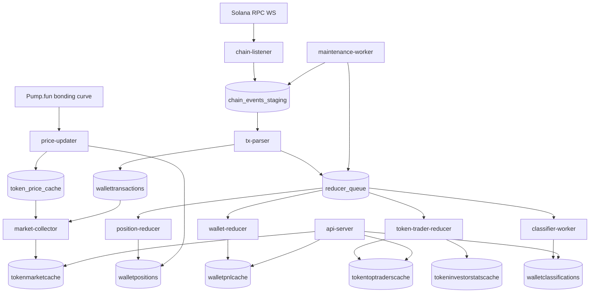

# Architecture — Realtime Memecoin Analytics

## Pipeline

## Worker responsibilities

| Worker | Reads | Writes | Trigger |
|---|---|---|---|
| chain-listener | Solana WS | chain_events_staging | N/A (stream) |
| tx-parser | chain_events_staging | wallettransactions, reducer_queue | poll |
| position-reducer | wallettransactions | walletpositions | reducer_queue |
| wallet-reducer | walletpositions, wallettransactions | walletpnlcache | reducer_queue |
| token-trader-reducer | walletpositions | tokentoptraderscache, tokeninvestorstatscache | reducer_queue |
| classifier-worker | walletpnlcache | walletclassifications | reducer_queue |
| market-collector | wallettransactions, token_price_cache | tokenmarketcache | timer (tiered) |
| price-updater | Pump.fun RPC | token_price_cache, walletpositions.unrealized | timer (15s) |
| maintenance-worker | reducer_queue, staging | retention + dead-letter | timer |

## Queue event types

- `position_update` (priority 9): recompute walletpositions(wallet, mint)
- `wallet_pnl_update` (priority 8): recompute walletpnlcache(wallet)
- `token_trader_update` (priority 7): rebuild tokentoptraderscache(mint)
- `classification_update` (priority 3): reclassify wallet (throttled)

## Operational CLI

- `python3 replay.py --rebuild-wallet <WALLET>`
- `python3 replay.py --rebuild-token <MINT>`
- `python3 replay.py --reparse-signature <SIG>`
- `python3 replay.py --recompute-position <WALLET> <MINT>`
- `python3 replay.py --dead-letter [--max-attempts N]`
- `python3 replay.py --retention`
- `python3 replay.py --health`

## Health endpoints

- `GET /health` — JSON consolidado (200 ok / 503 degraded)
- `GET /admin/datasource/stats?hours=24`
- `GET /admin/datasource/config`
- `GET /admin/compare/wallet/<w>`
- `GET /admin/compare/token/<mint>`

## Datasource modes

- `local` — never call Birdeye
- `hybrid` (default) — local first, Birdeye only if stale/miss
- `birdeye` — force Birdeye (bypass local)